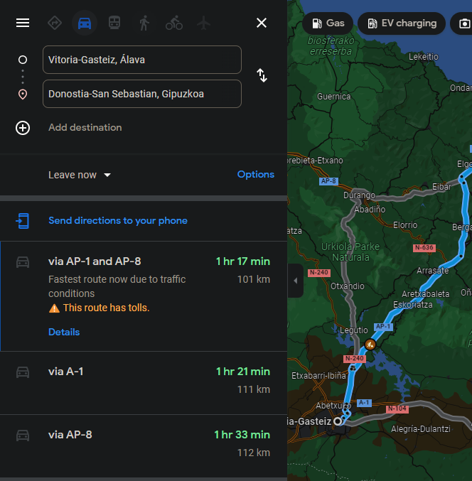
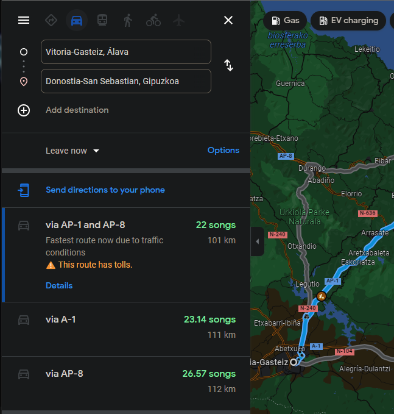

# Distance To Playlist Length Calculator

Google Maps extension, that calculates the distance between places by using the number of songs you would listen.

## Example

| Before  | After |
| ------------- | ------------- |
|   |  |
## Installation 

1. Download a zip file with the extension. 
1. Extract the contents of the zip file. 
1. Open the extension page in google chrome. 
1. Activate developer mode. 
1. Load unpacked extension.
